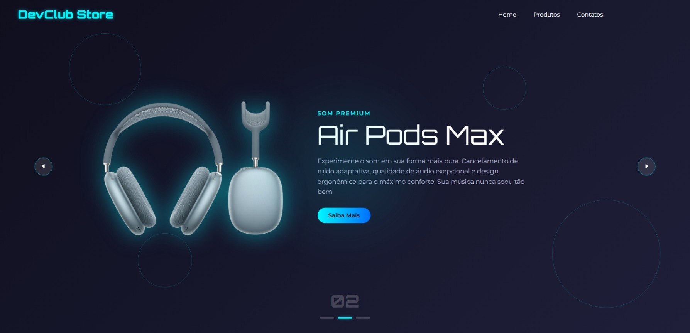

# 💻🛒 Site de produtos eletronicos || DevClub

Este projeto é uma landing page de uma loja fictícia de produtos tecnológicos, desenvolvida com HTML, CSS e JavaScript. Foi criado como parte do aprendizado com o vídeo [PROJETO CRIATIVO com HTML, CSS e JAVASCRIPT: A criação de um site com animações](https://www.youtube.com/watch?v=o_yiPCiwzUs) do canal DevClub | Programação.

## 📸 Preview

##  Acesse

-  [DevClub Store - GitHub Pages](https://maluwhoo.github.io/devclub-store-html-css-js/)

---
